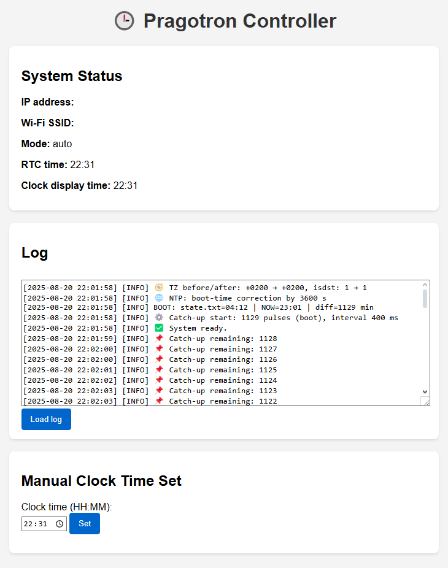

# Pragotron Controller (ESP32)




Minute-impulse controller for a **Pragotron** (or similar stepper) clock using an **ESP32**, **DS1307 RTC**, and an **H-bridge**. It keeps local time, drives the coil with alternating A/B pulses, exposes a small web UI, and persists state/logs on SD.

> **Status:** Production-tested on real hardware. Code is written for the Arduino framework.

---

## Features
- Minute tick generation with **A/B alternation** (protects coil & ensures correct stepping)
- **Catch-up** engine after power loss or manual edits (non-blocking)
- **RTC (DS1307)** holding **local time**; **NTP** sync in *auto* mode
- Robust **timezone handling** (POSIX TZ, EU DST, or fixed offsets)
- **Web API & static UI** served from SD (`/index.html`, `style.css`)
- **Logging** to SD (daily rotated files in `/logs/`)
- **State persistence** of display time (`/state.txt` with `HH:MM`)

---

## Hardware
- **MCU:** ESP32 (Arduino core)
- **RTC:** DS1307 (via RTClib)
- **Storage:** microSD (SPI)
- **Driver:** H-bridge (two GPIOs)

### Default GPIOs
```
IN1  ->  GPIO 25
IN2  ->  GPIO 26
SD_CS -> GPIO 5
```
Adjust in `main.cpp` if your wiring differs.

> **Safety:** You are driving an inductive load. Use a suitable H-bridge / driver per your coil current. Ensure proper supply, flyback handling, and isolation from the ESP32.

---

## Repository layout (to be finalized)
> You mentioned you’ll share the final folder structure. Below is the expected layout; we’ll update this section once you send the screenshot/tree.
```
PragotronController/
├─ src/
│  ├─ main.cpp
│  ├─ ConfigManager.(h|cpp)
│  ├─ Logger.(h|cpp)
│  ├─ RTCManager.(h|cpp)
│  ├─ StateManager.(h|cpp)
│  ├─ PulseManager.(h|cpp)
│  ├─ WebServerManager.(h|cpp)
│  └─ SystemManager.(h|cpp)
├─ data/                 # contents copied to SD card
│  ├─ config.json
│  ├─ index.html
│  ├─ style.css
│  ├─ state.txt
│  └─ logs/              # created automatically if missing
├─ img/
│  ├─ wiring.png
│  ├─ web.png
│  └─ clock.png
├─ README.md
└─ LICENSE (optional)
```

---

## Build & Flash
You can use **Arduino IDE** or **PlatformIO**.

### Arduino IDE
1. Install **ESP32 Arduino** core (Boards Manager).
2. Board: *ESP32 Dev Module* (or your variant).
3. Clone/copy sources into a single sketch or library structure.
4. Compile & upload.

### PlatformIO (recommended)
`platformio.ini` (example):
```ini
[env:esp32]
platform = espressif32
board = esp32dev
framework = arduino
monitor_speed = 115200
build_flags = -DCORE_DEBUG_LEVEL=0
```

---

## Configuration (`/config.json` on SD)
Place a `config.json` on the SD card root. Example based on your current file:

```json
{
  "wifi_ssid": "ssid",
  "wifi_password": "password",
  "ntp_server": "pool.ntp.org",
  "mode": "auto",
  "impulse_interval_sec": 60,
  "impulse_delay_ms": 200,
  "resync_rtc_if_diff_seconds": 60,
  "tz_mode": "posix",
  "posix_tz": "CET-1CEST,M3.5.0/2,M10.5.0/3",
  "time_zone_offset_hrs": 2,
  "time_zone_offset_min": 0,
  "use_eu_dst": true,
  "max_catchup_minutes": 1440,
  "web_edit_enabled": true,
  "debug_serial": true,
  "ntp_resync_every_minutes": 15
}
```
> **Note:** If the JSON happens to include duplicated keys (e.g., `ntp_server` twice), keep only one.

### Key fields
| Key | Type | Default | Description |
|---|---|---|---|
| `wifi_ssid`, `wifi_password` | string | "" | Wi-Fi credentials for NTP & web UI. |
| `mode` | `"auto" \| "manual"` | `"auto"` | In `auto`, NTP is used; in `manual`, device relies only on RTC. |
| `tz_mode` | `"posix" \| "eu" \| "fixed"` | `"eu"` | TZ handling mode. `posix` uses `posix_tz`; `eu` uses CET/CEST; `fixed` uses offsets. |
| `posix_tz` | string | – | POSIX TZ string (e.g., `CET-1CEST,M3.5.0/2,M10.5.0/3`). Used if `tz_mode="posix"`. |
| `time_zone_offset_hrs` | int | 0 | Fixed offset hours for `tz_mode="fixed"`. |
| `time_zone_offset_min` | int | 0 | Fixed additional minutes for `tz_mode="fixed"`. |
| `use_eu_dst` | bool | true | If true (or `tz_mode="eu"`), use CET/CEST rules. |
| `ntp_server` | string | `pool.ntp.org` | NTP hostname. |
| `ntp_resync_every_minutes` | int | 15 | Periodic NTP re-sync cadence in `auto` mode (min 1). |
| `resync_rtc_if_diff_seconds` | int | 60 | If absolute drift exceeds this, RTC is updated from NTP. |
| `impulse_interval_sec` | int | 60 | Nominal minute interval (info only; logic is based on RTC minute change). |
| `impulse_delay_ms` | int | 500 | **Pulse length** (ms). Dead-time after each pulse is ~150 ms. |
| `max_catchup_minutes` | int | 180 | Max allowed catch-up immediately after boot or re-sync. |
| `web_edit_enabled` | bool | false | Enables POST API to set `HH:MM`. |
| `debug_serial` | bool | false | Verbose logging to Serial monitor. |

---

## SD Card contents
At minimum, the SD card should contain:
```
/config.json
/index.html
/style.css        # optional styling for your UI
/state.txt        # created/updated automatically
/logs/            # directory for daily logs (auto-created)
```

---

## Runtime overview
1. **Startup order:** SD → Config → Wi‑Fi → RTC/TZ (NTP if auto) → Logger → State → Pulse → System → Web.
2. **Initial NTP (auto):** if drift is ~1h, treat as DST/TZ jump (no catch-up, only align). Otherwise, apply correction & possibly trigger catch-up.
3. **Minute tick:** When the RTC minute changes, emit one pulse (A/B alternating) and persist `HH:MM`.
4. **Catch-up:** On boot or after significant correction, emit fast pulses (with safe dead-time) until display matches RTC.

---

## Web API
Base path: `http://<device-ip>/`

- `GET /` → serves `/index.html`
- `GET /api/status` → device JSON status
- `POST /api/set-state` → `{ "clock_time": "HH:MM" }` (requires `web_edit_enabled=true`)
- `GET /api/log` → today’s log, or newest from `/logs`
- `GET /api/logs` → list available logs
- `GET /api/logfile?file=YYYY-MM-DD.txt` → download a specific log

**Status response example**
```json
{
  "device_ip": "192.168.1.23",
  "wifi_ssid": "MyAP",
  "mode": "auto",
  "web_edit": true,
  "rtc_time": "14:03",
  "clock_time": "14:02"
}
```

---

## Logging
- Daily rotation: `/logs/YYYY-MM-DD.txt`
- Single file (if path ends with `.txt`): e.g., `/log.txt`
- Timestamp format: `YYYY-MM-DD HH:MM:SS` in **local time**

---

## Timekeeping
- **RTC:** DS1307 stores **local time** (not UTC). `RTCManager` applies TZ rules.
- **NTP:** in `auto` mode; periodic re-sync (default 15 min). 1-hour deltas are treated as DST/TZ changes (no catch-up).

---

## Troubleshooting
- **SD init failed:** Check CS pin (`SD_CS`, default 5), wiring, card format (FAT32).
- **RTC not found:** Verify DS1307 wiring and power; pull-ups on I²C; address 0x68.
- **Wi‑Fi offline / NTP skipped:** Device will still run using RTC; enable `manual` mode if you want to fully disable NTP.
- **No logs created:** Ensure `/logs/` exists or logger path is a directory; enough free space on SD.
- **Wrong timezone:** Set `tz_mode` appropriately. For custom rules, use a POSIX TZ string in `posix_tz`.

---

## Development notes
- Code style: single-responsibility managers (`*Manager` classes)
- Timestamps in logs use the same local-time source as the minute pulses
- `PulseManager` enforces a minimum gap and includes a dead-time to protect the bridge

---

## License
Choose a license (MIT recommended for simplicity). Add a `LICENSE` file to the repo.

---

## Credits
- Arduino-ESP32 core, RTClib, ArduinoJson
- Inspired by traditional Pragotron step clocks and community projects

